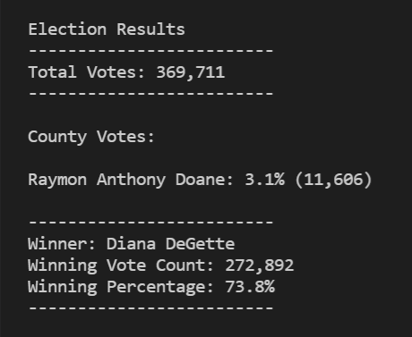
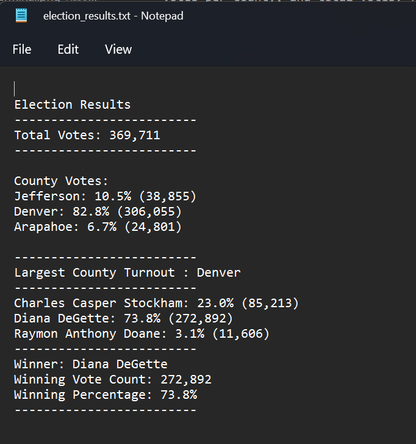

# Election Analysis with Python

## Overview of Election Audit
The purpose of this project is to analyze data from a congressional election, using a python script to determine the winner, as well as votes per candidate, votes per county, and total votes. The election data is presented in a csv file, and the results are printed in a txt file. Input file can be found on [election-results.csv](Resources/election_results.csv), the output on [election-results.txt](analysis/election_results.txt), and the script on [PyPoll_Challenge.py](PyPoll_Challenge.py).

## Election-Audit Results
The audit of the election resulted in the following:

- 369,711 people casted a ballot in this election.
- From the total, 6.7% (24,801) votes were registered in Arapahoe, 10.5% (38,855) in Jefferson, and the vast majority, 82.8% (306,055), in Denver. 
- As stated before, the county with the largest number of votes was Denver with 82,8% of the total votes.
- Votes per candidate were the following: 3.1% (11,606) for Raymon Anthony Doane, 23.0% (85,213) for Charles Casper Stockham, and 73.8% (272,892) for Diana DeGette.
- The winner of the election was Diana DeGette with 73.8% of total votes.

The images below show the results printed in a terminal and in the text file, respectively.

  

## Election-Audit Summary
This script proofed to be reliable and efficient on auditing this election results. With minor adjustments, it would be ready to meet any need of the election comission. For example, to meet the requirements of a national election, would be needed to add a new column in the csv file to store the state or province, then add new variables to store these values (i.e. state_options[], state_votes{}), include a conditional statement to count the votes per state, and finally, create a new for loop to print the results per state. Another possible scenario would be a municipal election, in this case, instead of storing counties, it would store city districts. However, the steps on the algorithm would remain exactly the same, changes would be the title of the column 'county', the name of the variables that mention county, and the messages used to print the results.