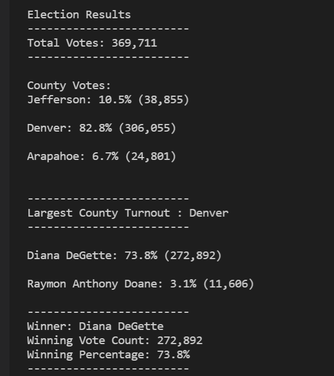

# Election Analysis with Python

## Overview of Election Audit
The purpose of this project is to analyze data from a congressional election, using a python script to determine the winner, as well as votes per candidate, votes per county, and total votes. The election data is presented in a csv file, and the results are printed in a txt file. Input file can be found on [election-results.csv](Resources/election_results.csv), the output on [election-results.txt](analysis/election_results.txt), and the script on [PyPoll_Challenge.py](PyPoll_Challenge.py).

## Election-Audit Results
The audit of the election resulted in the following:

- 369,711 votes were registerd in this election.
- Below is the breakdown of the number of votes per county:
    - Jefferson: 10.5% (38,855)
    - Denver: 82.8% (306,055)
    - Arapahoe: 6.7% (24,801)
- As stated before, the county with the largest number of votes was Denver with 82,8% of the total votes.
- Below is the breakdown of the number of votes per candidate
    - Charles Casper Stockham: 23.0% (85,213)
    - Diana DeGette: 73.8% (272,892)
    - Raymon Anthony Doane: 3.1% (11,606)
- The winner of the election was Diana DeGette with 73.8% of total votes.

The images below show the results printed in the terminal and in the text file, respectively.

  

## Election-Audit Summary
In a summary statement, provide a business proposal to the election commission on how this script can be used—with some modifications—for any election. Give at least two examples of how this script can be modified to be used for other elections.